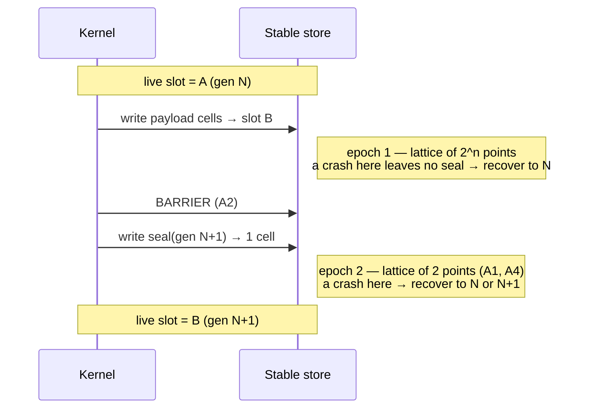

# Design Doc: Checkpoint Storage Model

**Project:** highlander — an orthogonally persistent kernel
**Scope of this doc:** the storage model, its axioms and the crash consistency theorem — rung 1 of the ladder.
**Status:** Model locked. **Proof complete** — see `docs/design/0002-what-was-proven.md` for the differences between this document and the artifact.
**Author:** Mark

---

## 1. Thesis

An orthogonally persistent kernel writes the *full state of the machine* to stable storage as one atomic transaction. The full state includes each process, each register and each page. There is no file system, no save command and no serialization step. After a crash, the machine continues from the middle of an instruction. It does not do a reboot.

A process does no work to be persistent. A process is persistent because it exists.

Related work: KeyKOS and EROS. KeyKOS operated production banking workloads. This project does not use the x86 paging method of Phil Opp. That method gets protection from the hardware: the MMU, the rings and the page tables. A formal proof cannot easily examine that hardware. In this project the proof gives protection and consistency. Thus Verus does necessary work, and it is not decoration.

### 1.1 Why the storage model is first

A checkpoint tears if it holds a mixture of the old data and the new data. If a checkpoint can tear, each layer above the checkpoint layer has no value. The crash consistency theorem is the first lemma of the full system, and it is the one part that is:

- complete in itself (the model is abstract, thus it needs no hardware),
- possible to finish (1 or 2 weekends of work, and not 3 months),
- and of value even if no person builds rungs 2 to 5.

If the project stops after this deliverable, the artifact still has value. It is a verified checkpoint journal.

### 1.2 Out of scope for this document

- The executor, the scheduler and the process model
- Page tables, COW records and incremental checkpoints
- Device drivers and the I/O journal (see §8 — recorded, and delayed)
- Any specific hardware

---

## 2. The frame: a write-ahead log for an operating system

This design applies the write-ahead log method to a full machine. The rule is the same: the intent lands in durable storage before the state that the intent describes. The order of the barrier and the seal below obeys this rule.

There are 4 differences from the write-ahead log of a database. Each difference has an effect on the design:

| | Database write-ahead log | Persistent kernel |
|---|---|---|
| **Content of the log** | a selected semantic delta (a tuple changed) | images of physical pages — the kernel has dirty pages and no knowledge of their meaning |
| **Transaction boundary** | the application declares a commit | none. Checkpoints occur on a timer, at an arbitrary instruction |
| **I/O** | the database owns everything inside its own walls | the kernel does not own the NIC, the UART or the DMA target (§8) |
| **Layer below** | a file system, which can correct some errors | nothing. This *is* the lowest layer |

The last row is the reason for the read-only rule for recovery in §7. That rule is necessary, and it is not an improvement.

---

## 3. Storage model

### 3.1 Cells, and not sectors

The theorem needs 3 things from storage, and no more:

1. a collection of **cells** that a write can replace one at a time,
2. **atomic replacement of one cell**,
3. a **fence**.

The theorem needs no bytes, no block sizes and no addresses. Thus the model is abstract in the type of the value:

```rust
pub struct Store<V> { cells: Map<CellId, V> }
```

Thus a cell is a parameter. A cell can be a block of 512 bytes, a NAND page, an IndexedDB key, an S3 object or a word of battery-backed RAM. This is not a goal for portability. It is a result of a model that states no more than it needs.

> **Risk — an empty model.** If the construction of the model makes each cell atomic, then the model assumes A1 (§5). A1 is the one axiom with content. §6.3 gives the correction: the abstract layer must keep the torn write available, and a refinement layer must discharge A1. A definition must not remove A1.

### 3.2 Deltas

A **delta** is a partial map `δ : CellId ⇀ V`. A store and a delta have the same carrier, and this is the reason that the algebra operates.

---

## 4. The algebra

There are 2 monoids on the same carrier. This is the centre of the design.

### 4.1 Sequence — override (`◁`)

The right operand wins:

```
(s ◁ δ)(c) = δ(c)   if c ∈ dom δ
             s(c)   otherwise
```

`(Deltas, ◁, ∅)` is a monoid. It is total and associative, but it is **not commutative**.

### 4.2 Separation — disjoint union (`•`)

`•` is defined **only if** `dom δ₁ ∩ dom δ₂ = ∅`.

`(Deltas, •, ∅)` is a **partial commutative monoid**. It is associative, commutative, cancellative and unital. It is a separation algebra. The `⊕` operator of separation logic occurs here, although the design did not plan for it.

### 4.3 The bridge lemma

```
disjoint(δ₁, δ₂)  ⟹  δ₁ ◁ δ₂ = δ₁ • δ₂
```

**A sequence becomes a separation if the order has no effect.** Each result below uses this lemma. If the lemma is difficult to prove, then the definitions are wrong. Correct the definitions before you continue.

### 4.4 What the algebra explains

The condition "*no 2 writes in 1 epoch touch the same cell*" is not a detail of the implementation. It is the **condition for the definition of `•`**, and it lets the model treat the writes in 1 epoch as unordered. This condition occurs 3 times in this design (§4.2, §6.1 and §7.2). This shows that the algebra does necessary work, and that it is not decoration.

---

## 5. Axioms

This section states each axiom, because the value of the result is a reduction. It reduces the crash consistency of a full machine to a small set of hardware promises that have **names**.

| ID | Statement | Type | Where it is false |
|---|---|---|---|
| **A1** | A write to one cell lands fully, or the write does not land | hardware promise | raw NAND: a partial program operation leaves some bits at 0 |
| **A2** | All writes before a barrier land before all writes after the barrier | hardware promise | for many years, consumer SSDs with volatile write caches did not obey this rule |
| **A3** | The generation counter never wraps | free with 64 bits, but stated | — |
| **A4** | The seal is in one cell only | design condition | if the seal uses more than 1 cell, A1 gives nothing and the argument fails |

### 5.1 The CRC is not the reason this design operates

With A1 and A2 only, the protocol of 2 slots is correct without a checksum: the payload writes, then the barrier, then one atomic write of the seal. If the new seal is present, then its payload is complete.

The task of the CRC is different. It gives more protection if A1 or A2 is false. Its guarantee is *probabilistic*, because a torn cell can pass the check by chance. Verus cannot prove this property. Do not show it as a proven result. The CRC enters as an assumption with a stated probability of collision, and it stays outside the proof.

### 5.2 The form of the result

> The crash consistency of a full machine reduces to 2 hardware promises, with a probabilistic test for the condition in which the hardware breaks them.

Almost all real systems depend on this reduction. Almost no real system records it.

---

## 6. Crash model

### 6.1 Programs and epochs

A commit is a *program*. A crash is a *schedule for the writes*.

```rust
pub enum Op { Write(CellId, V), Barrier }
pub type Program = Seq<Op>;
```

An **epoch** is the set of writes between 2 barriers. `•` assembles an epoch, thus an epoch has no order. `◁` sequences the epochs into a program:

```
p = e₁ ◁ e₂ ◁ … ◁ eₙ
```

**Condition (from §4.4):** in one epoch, no 2 writes touch the same cell.

### 6.2 The crash lattice

A crash in epoch *k* gives:

```
Crash_k(p) = { e₁ ◁ … ◁ e_{k-1} ◁ σ  |  σ ⊑ e_k }
```

`σ ⊑ e` means that σ is a restriction of e to a subset of its domain.

**`⊑` makes the sub-deltas of an epoch a Boolean lattice.** That lattice is isomorphic to `𝒫(dom e_k)`. The top point is "all writes landed", the bottom point is "no write landed", and there are `2^|dom e_k|` points.

Thus the model with an arbitrary subset is not an unwanted quantifier. It is this statement: *recovery operates on a Boolean lattice of 2ⁿ points.*

> **Why an arbitrary subset, and not an order?** Real devices change the order of the writes between barriers. A proof that assumes an order gives a result about a machine that no person has. This is how checkpoint code that passes its tests causes damage in operation.

### 6.3 The formal position of A1

Prove the theorem for abstract cells. Then, in a **refinement layer**, use `V = Seq<u8>` with a `tear()` relation. Then show that **A1 is exactly the assumption that `tear` is trivial.**

This gives A1 a formal position, and not a comment in the text. It is also the correction for the risk of an empty model in §3.1.

---

## 7. Commit protocol and the theorem

**Note on scope.** This section describes 1 commit. A machine does many commits, and the state after a commit does not obey the conditions of this section. `docs/design/0002-what-was-proven.md` §5a describes the correction and the proof for a full run.

### 7.1 Two checkpoint slots

**Decision: two checkpoint slots, and not an append-only log.** See `docs/adr/0001-ping-pong-vs-log.md`.

An append-only log has a much simpler crash model: `crash(log, n) = log.take(n)`, with no epochs, no barriers and no change of order. But storage is not infinite, thus a log needs compaction. **Compaction is an atomic change from one state to another state, which is what 2 slots do.** The difficult problem arrives in both designs. The log only delays the problem, and the delay puts it after a system that operates. A person must then change that system. Do the difficult part first, when it is the only part.

There are 2 checkpoint slots. A generation number and a CRC seal each slot. A commit is 2 epochs:

```
p = e_payload ◁ e_seal        where |dom e_seal| = 1
```



### 7.2 Why the protocol is correct, in one line

**The lattice of the seal epoch has 2 points, ⊥ and ⊤.** That is the full argument. A1 is the statement that this lattice has 2 points, and not `2^bytes` points.

- **A crash in the payload epoch** leaves no seal. Thus recovery reads the live slot only. All `2ⁿ` points become a **single point**, which is state N. The reason is that `dom e_payload` is disjoint from the footprint of the live slot (the condition for `•` again).
- **A crash in the seal epoch** gives 2 points, which are `{N, N+1}`.

### 7.3 The theorem

```
|image(recover ∘ Crash(p))| ≤ 2
```

**Falsifiability test — the proof must fail for the correct reason.** Remove the barrier. The payload and the seal then become 1 epoch, and the lattice of that epoch holds the point *"the seal landed, the payload did not land"*. That point recovers to a state that is not N and not N+1. If the proof still passes after you remove the barrier, then the model is empty. Correct the model before you build anything on it.

### 7.4 Checkpoint policy

**Decision: the checkpoint frequency is configurable, and not fixed.** Correctness must not depend on the interval. The theorem in §7.3 covers *each* point of interruption. Thus a change of the policy can only exchange durability lag for throughput. It cannot change consistency. State this result as a property: *a change of the checkpoint policy has no effect on the crash consistency theorem.*

There are 2 notes on the parts that this decision does **not** settle.

**Trigger unit: a count of instructions.** Determinism is a hard requirement. A checkpoint at a repeatable point makes the continuation repeatable, and that property makes rung 4 possible to test. A wall clock and a count of dirty cells both depend on the execution, thus this design rejects both as the primary trigger. There are 2 more notes, and this document must not hide them:

- *Determinism in a simulator does not transfer to hardware.* Callgrind is deterministic because Callgrind is a simulator. The instruction counters of real hardware are not deterministic. Interrupts, SMM, speculation and the accounting of page faults all change the count of retired instructions between runs. The `rr` project met this problem. It selected **the count of retired conditional branches, with the program counter to break a tie**, because raw counts of instructions were not reliable on real silicon. Examine any counter for this project in the same way. Do not trust the PMU until you measure it.
- *A deterministic trigger does not give a deterministic execution.* A trigger at instruction N is repeatable only if the stream of instructions is also repeatable. The stream of a kernel depends on the times of its interrupts. Thus a repeatable continuation also needs a journal of the interrupt schedule. This is the same boundary problem as §8. The trigger unit is the simple part of the problem.

Correctness does not depend on the policy (see above). Thus the policy can be an enum: a count of instructions for deterministic test and replay modes, and a wall clock or a count of dirty cells in production, where a repeatable run is not the goal. That choice cannot change the theorem.

**Rung 2 is still necessary.** A stop of the full machine is still a stop, even if the interval is configurable. A change to the interval only moves the pause. COW page records remove the pause. A configurable interval makes the pause acceptable during rungs 1 to 4. It does not remove the pause.

### 7.5 Recovery is a closure operator

```
recover ∘ recover = recover
```

Its fixed points are the clean stores. Thus recovery is a retraction `Store ↠ Clean`.

There are 2 rules, and the "nothing below" row of §2 makes both rules necessary:

1. **Read only, until the kernel commits to a slot.** Power can fail *during recovery*. A recovery that writes before it decides can destroy the only valid checkpoint. The formal statement is: "`recover` restricted to `Clean` is the identity".
2. **Never write the slot with the live seal.** The formal statement is `δ # live_footprint`, which is the condition for the definition of `•` for the third time. This rule makes the design a true design of 2 slots, and not a design of 1 slot with more steps.

---

## 8. Known limitation: the I/O boundary

**The external world does not go back to an earlier state.** The machine makes a checkpoint at N+1, then the machine crashes, then the machine continues from N. But the network packet went out, the UART byte went out and the DMA transfer completed.

Orthogonal persistence is fully orthogonal only inside the machine. Each I/O boundary needs a journal and idempotency. KeyKOS did this work. Few designs discuss this part.

This problem has the same structure as the idempotency of an activity in a durable workflow engine, which is a solved problem one layer above (see `autumn-harvest`).

This problem is out of scope for rung 1. This document records it. Then no person finds it late.

---

## 9. The ladder

| Rung | Deliverable | Status |
|---|---|---|
| **1** | **verified checkpoint commit and recover, on the abstract cell model** | **✅ complete** |
| **2** | **COW page records, to prevent a stop of the full machine at a checkpoint** | **✅ complete** |
| **3** | **capture of the true machine state (registers, page tables) into a checkpoint** | **✅ complete** |
| **4** | **continuation of 1 simple process after a hard reset** | **✅ complete** |
| 5 | an I/O journal at the boundary (§8) | — |

Rungs 1 to 4 are complete. Each rung has value alone. Rung 5 is optional.

---

## 10. Proof plan (rung 1)

Do the spine first. Each step is a condition for the next step:

1. `Delta = Map<CellId, V>`, then `override(δ₁, δ₂)`, then `disjoint_union(δ₁, δ₂)` with the condition for its definition.
2. The monoid laws for both operators. Give an explicit counterexample for the non-commutativity of `◁`. Do not state it as a lemma.
3. **The bridge lemma (§4.3).** Each result below uses it. If it is difficult to prove, then the definitions are wrong.
4. `sub_delta(σ, e)` and the set of crash results.
5. The theorem (§7.3).

### 10.1 Acceptance gates

- [x] **Negative test:** remove the barrier, and the proof must *fail*. (§7.3) — `scripts/gate.sh`
- [x] **Concrete instantiation:** 2 cells and 1 seal. Examine a crash at each lattice point by hand. This shows that the algebra describes a machine, and not only itself. — `concrete.rs`
- [x] Property tests (proptest) against a reference implementation, to complement the proof. — `crates/highlander-ref`
- [x] The refinement layer for A1 (§6.3) exists, or a note records its delay. — `refine.rs`

---

## 11. Open questions

1. **Which hardware counter** supports the trigger for the count of instructions on each target? Does that counter survive the criticism from `rr`? See §7.4.
2. **The position of the generation counter.** Is it inside the seal cell (as this document assumes), or is it separate?
3. **The TTM view.** `Store` is a relation `{CellId, V}` with the key `CellId`, and `◁` is relational override: `s ◁ δ = (s WHERE id ∉ δ[id]) ∪ δ`. The key constraint *is* functionality. Thus "δ is a well-formed epoch" and "δ is a valid relation value" are the same statement. If the thesis of a relational kernel is more than an aesthetic, this is the position where it becomes literal: the storage layer is already a relvar, and a commit is already a relational assignment. This needs a separate document, and it is out of scope here.

---

## Appendix A: Provenance

This design came from a chat about ideas for a `no_std` project. The chat started with a durable workflow engine, then moved through durability in wasm and the browser, then arrived at orthogonal persistence as the generalization: *each process is a durable workflow, at no cost, and without a workflow engine.*
