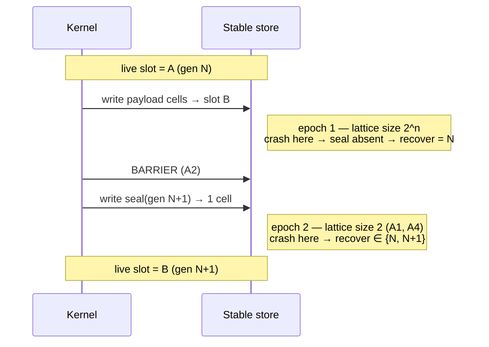

# Design Doc: Checkpoint Storage Model

**Project:** highlander — an orthogonally persistent kernel
**Scope of this doc:** The storage model, its axioms, and the crash-consistency theorem — rung 1 of the ladder.
**Status:** Model locked. **Proof complete** — see `docs/design/0002-what-was-proven.md` for the delta between this document and the artifact.
**Author:** Mark

---

## 1. Thesis

An orthogonally persistent kernel checkpoints the *entire machine state* — every process, every register, every page — to stable storage as an atomic transaction. There is no filesystem, no `save`, no serialization step. A crash resumes mid-instruction rather than rebooting.

Persistence stops being something a process *does* and becomes a property of *existing*.

Lineage: KeyKOS (ran production banking workloads), EROS. Deliberately **not** the Phil Opp / x86-paging path — that route derives protection from hardware (MMU, rings, page tables), which is largely unreachable by formal proof. Here, protection and consistency derive from *proof*, which makes Verus load-bearing rather than decorative.

### 1.1 Why the storage model comes first

Everything above the checkpoint layer is meaningless if the checkpoint can tear. The crash-consistency theorem is the foundational lemma of the entire system, and it is the one piece that is:

- self-contained (no hardware required — the model is abstract),
- finishable (a weekend or two, not a quarter),
- and reusable regardless of whether rungs 2–5 ever get built.

If the project stops after this doc's deliverable, the artifact still stands on its own as a verified append-only/checkpoint journal.

### 1.2 Non-goals for this document

- Executor, scheduler, process model
- Page tables, COW tracking, incremental checkpointing
- Device drivers, I/O journaling (see §8 — acknowledged, deferred)
- Any concrete hardware target

---

## 2. The frame: an OS-level WAL

The design is recognizably write-ahead logging applied to a whole machine. The discipline — *intent lands durably before the state it describes* — is exactly the barrier-then-seal ordering below.

Four differences from a database WAL are worth stating, because they drive the design:

| | Database WAL | Persistent kernel |
|---|---|---|
| **What's logged** | A curated semantic delta (tuple changed) | Physical page images — the kernel has dirty pages and no idea what they mean |
| **Transaction boundary** | The application declares commit | None. Checkpoints fire on a timer at an arbitrary instruction |
| **I/O** | The DB owns everything inside its walls | The kernel doesn't own the NIC, the UART, or the DMA target (§8) |
| **What's underneath** | A filesystem, which can catch mistakes | Nothing. This *is* the bottom layer |

The last row is why §7's read-only-recovery rule is non-negotiable rather than a nicety.

---

## 3. Storage model

### 3.1 Cells, not sectors

The theorem needs exactly three things from storage:

1. a collection of independently replaceable **cells**,
2. **atomic replacement of one cell**,
3. a **fence**.

It does not need bytes, block sizes, or addresses. So the model is abstract over the value type:

```rust
pub struct Store<V> { cells: Map<CellId, V> }
```

"Cell" is therefore a *parameter*, instantiable as a 512B block, a NAND page, an IndexedDB key, an S3 object, or a battery-backed RAM word. This is not an aspirational portability goal — it simply falls out of not over-specifying.

> **Risk — vacuity.** If cells are atomic *by construction*, the model has assumed away A1 (§5), the one interesting axiom. Mitigation in §6.3: the abstract layer must keep the torn write *available*, and A1 must be discharged in a refinement layer, not defined out of existence.

### 3.2 Deltas

A **delta** is a partial map `δ : CellId ⇀ V`. Stores and deltas share a carrier, which is what makes the algebra work.

---

## 4. The algebra

Two monoids over the same carrier. This is the core of the design.

### 4.1 Sequencing — override (`◁`)

Right wins:

```
(s ◁ δ)(c) = δ(c)   if c ∈ dom δ
             s(c)   otherwise
```

`(Deltas, ◁, ∅)` is a monoid: total, associative, **non-commutative**.

### 4.2 Separation — disjoint union (`•`)

Defined **only when** `dom δ₁ ∩ dom δ₂ = ∅`.

`(Deltas, •, ∅)` is a **partial commutative monoid** — associative, commutative, cancellative, unital. This is a separation algebra; `⊕` from separation logic arrives without being invited.

### 4.3 The bridge lemma

```
disjoint(δ₁, δ₂)  ⟹  δ₁ ◁ δ₂ = δ₁ • δ₂
```

**Sequencing collapses into separation exactly when order stops mattering.** Everything downstream leans on this. If it fights during proof, the definitions are wrong — fix them before proceeding.

### 4.4 What the algebra retroactively explains

The well-formedness condition "*no two writes to the same cell within one epoch*" is not an implementation detail. It is the **definedness side-condition of `•`**, and it is what licenses modeling within-epoch landing as unordered. It shows up three times in this design (§4.2, §6.1, §7.2) — a good sign the algebra is carrying weight rather than decorating.

---

## 5. Axioms

Stated explicitly, because the entire value of the result is that it reduces machine-wide crash consistency to a small set of *named* hardware promises.

| ID | Statement | Nature | Where it's false |
|---|---|---|---|
| **A1** | A single cell write lands entirely or not at all | Hardware promise | Raw NAND — a partial program leaves some bits cleared |
| **A2** | All writes issued before a barrier land before any issued after | Hardware promise | Consumer SSDs with volatile write caches have lied about this for decades |
| **A3** | The generation counter never wraps | Free at 64 bits — stated anyway | — |
| **A4** | The seal fits in exactly one cell | Design constraint | If the seal spans cells, A1 buys nothing and the argument collapses |

### 5.1 The CRC is not what makes this work

Under **A1 + A2 alone**, ping-pong is already correct with no checksum: payload writes → barrier → single atomic seal write. If the new seal is present, its payload necessarily completed.

The CRC's role is precisely: **defense-in-depth against A1 and A2 being false.** Its guarantee is *probabilistic* — a torn cell can accidentally validate. This is not provable in Verus and must not be presented as if it were. It enters as an assumption with a stated collision probability, explicitly quarantined from the proven core.

### 5.2 The shape of the result

> Crash consistency of the whole machine reduces to two stated hardware promises, with a probabilistic backstop for when they are broken.

Nearly every real system depends on exactly this. Almost none write it down.

---

## 6. Crash model

### 6.1 Programs and epochs

A commit is a *program*; a crash is a *landing schedule*.

```rust
pub enum Op { Write(CellId, V), Barrier }
pub type Program = Seq<Op>;
```

An **epoch** is the set of writes between two barriers, assembled by `•` — therefore order-free by construction. A program is epochs sequenced by `◁`:

```
p = e₁ ◁ e₂ ◁ … ◁ eₙ
```

**Precondition (from §4.4):** within any single epoch, no two writes target the same cell.

### 6.2 The crash lattice

A crash in epoch *k* yields:

```
Crash_k(p) = { e₁ ◁ … ◁ e_{k-1} ◁ σ  |  σ ⊑ e_k }
```

where `σ ⊑ e` means σ is a restriction of e to a subset of its domain.

**`⊑` makes the sub-deltas of an epoch a Boolean lattice**, isomorphic to `𝒫(dom e_k)`: top is "everything landed," bottom is "nothing landed," `2^|dom e_k|` points total.

So the arbitrary-subset crash model is not a nuisance quantifier. It is: *recovery is evaluated over a Boolean lattice of size 2ⁿ.*

> **Why arbitrary subset, and not in-order?** Real devices reorder freely between barriers. Assuming in-order landing proves something true of a machine nobody owns, and is exactly how "worked in testing" checkpoint code corrupts itself in the field.

### 6.3 Where A1 lives formally

Prove the theorem over abstract cells, then in a **refinement layer** instantiate `V = Seq<u8>` with a `tear()` relation, and show that **A1 is exactly the assumption that `tear` is trivial.**

This gives A1 a formal home instead of a prose comment, and it is the mitigation for the vacuity risk flagged in §3.1.

---

## 7. Commit protocol and the theorem

### 7.1 Ping-pong

**Decision: ping-pong slots, not an append-only log.** See `docs/adr/0001-ping-pong-vs-log.md`.

An append-only log has a strictly simpler crash model — `crash(log, n) = log.take(n)`, no epochs, no barriers, nothing to reorder. But bounded storage requires compaction, and **compaction is an atomic switchover between two states — which is ping-pong.** The problem arrives either way; the log merely defers it behind a working system that will then have to be retrofitted. Build the hard part first, while it is the only part.

Two checkpoint slots. Each sealed with a generation number and a CRC. Commit is two epochs:

```
p = e_payload ◁ e_seal        where |dom e_seal| = 1
```



### 7.2 Why it is correct, in one line

**The seal epoch's lattice has two points, ⊥ and ⊤.** That is the entire argument. A1 is precisely the claim that this lattice is 2 and not `2^bytes`.

- **Crash in payload** → seal absent → recovery reads only the live slot. All `2ⁿ` points collapse to a **single point**, state N — because `dom e_payload` is disjoint from the live slot's footprint (the `•` condition again).
- **Crash in seal** → two points → `{N, N+1}`.

### 7.3 The theorem

```
|image(recover ∘ Crash(p))| ≤ 2
```

**Falsifiability check — it must fail for the right reason.** Drop the barrier: payload and seal merge into one epoch whose lattice contains the point *"seal landed, payload didn't,"* which recovers to a state that is neither N nor N+1. If the proof still verifies with the barrier removed, the model is vacuous and must be fixed before anything is built on it.

### 7.4 Checkpoint policy

**Decision: checkpoint frequency is configurable, not fixed.** Correctness must not depend on the interval — the theorem in §7.3 quantifies over *any* interruption point, so a policy change can only trade durability lag against throughput, never consistency. This is worth asserting as a property: *the crash-consistency theorem is invariant under checkpoint policy.*

Two notes on what this decision does **not** settle:

**Trigger unit: instruction count.** Determinism is a hard requirement — a checkpoint that fires at a reproducible point makes resume reproducible, which is what makes rung 4 testable at all. Wall-clock and dirty-cell count are both execution-dependent and are rejected as the primary trigger for that reason. Two caveats that must not be glossed:

- *Simulated determinism does not transfer to hardware.* Callgrind is deterministic because it is a simulator. Hardware instruction counters are not — interrupts, SMM, speculation, and page-fault accounting all perturb retired-instruction counts run to run. The `rr` project hit exactly this and settled on **retired conditional branches plus the program counter as a tiebreak**, having found raw instruction counts unreliable on real silicon. Whatever counter is chosen here needs the same scrutiny; assume the PMU lies until measured.
- *A deterministic trigger does not give a deterministic execution.* Firing at instruction N is reproducible only if the instruction stream itself is, and a kernel's stream depends on interrupt timing. Reproducible resume therefore also requires the interrupt schedule to be journaled — the same boundary problem as §8. The trigger unit is the easy half.

Because correctness is policy-invariant (above), the policy can reasonably be an enum: instruction count for deterministic test and replay modes, wall-clock or dirty-cell count in production where reproducibility is not the goal. Nothing about that choice can affect the theorem.

**Rung 2 is still required.** A configurable stop-the-world is still a stop-the-world; tuning the interval only moves the pause around. COW page tracking is what removes it. Configurability makes the pause *tolerable* during rungs 1–4, not absent.

### 7.5 Recovery is a closure operator

```
recover ∘ recover = recover
```

Its fixed points are the clean stores, so recovery is a retraction `Store ↠ Clean`.

Two rules follow, both non-negotiable given §2's "nothing underneath" row:

1. **Read-only until committed to a slot.** Power can fail *during recovery*; a recovery that writes before deciding can destroy the only valid checkpoint. "`recover` restricted to `Clean` is the identity" is the formal statement of this.
2. **Never write the slot whose seal is currently live.** Formally `δ # live_footprint` — the definedness of `•`, third appearance. This is what makes ping-pong genuinely two-slot rather than one-slot-with-extra-steps.

---

## 8. Known limitation: the I/O boundary

**The outside world does not roll back.** Checkpoint at N+1, crash, resume from N — but the packet was sent, the UART byte went out, the DMA landed.

Orthogonal persistence is only truly orthogonal *inside* the machine. Every I/O boundary needs journaling and idempotency. KeyKOS handled this; it is the least-discussed part of the design.

Note this is structurally identical to activity idempotency in a durable workflow engine — a solved problem one layer up (see `autumn-harvest`).

Out of scope for rung 1. Flagged here so it is not discovered late.

---

## 9. Milestone ladder

| Rung | Deliverable | Status |
|---|---|---|
| **1** | **Verified checkpoint commit/recover over the abstract cell model** | **✅ complete** |
| 2 | COW page tracking so a checkpoint doesn't stop the world | — |
| 3 | Capture real machine state (registers, page tables) into a checkpoint | — |
| 4 | Resume a single trivial process across a hard reset | — |
| 5 | I/O journaling at the boundary (§8) | — |

Rung 1 is complete and useful in isolation. Rungs 2–5 are explicitly optional.

---

## 10. Proof plan (rung 1)

Spine first — each step gates the next:

1. `Delta = Map<CellId, V>`; `override(δ₁, δ₂)`; `disjoint_union(δ₁, δ₂)` with its definedness side-condition.
2. Monoid laws for both. Non-commutativity of `◁` as an explicit counterexample, not a lemma.
3. **The bridge lemma (§4.3).** Everything leans on this. If it resists, the definitions are wrong.
4. `sub_delta(σ, e)` and the crash-outcome set.
5. The theorem (§7.3).

### 10.1 Acceptance gates

- [x] **Negative case:** remove the barrier; the proof must *fail*. (§7.3) — `scripts/gate.sh`
- [x] **Concrete instantiation:** two cells, one seal, hand-check a crash at every lattice point — confirm the algebra describes a machine and not just itself. — `concrete.rs`
- [x] Property tests (proptest) against a reference implementation, complementing the proof. — `crates/highlander-ref`
- [x] A1's refinement layer (§6.3) exists, or is explicitly deferred with a note. — `refine.rs`

---

## 11. Open questions

1. **Which hardware counter** backs the instruction-count trigger on each target — and whether it survives the `rr` critique. See §7.4.
2. **Generation counter placement** — inside the seal cell (assumed here) or separate?
3. **TTM angle.** `Store` is a relation `{CellId, V}` keyed on `CellId`, and `◁` is relational override: `s ◁ δ = (s WHERE id ∉ δ[id]) ∪ δ`. The key constraint *is* functionality, so "δ is a well-formed epoch" and "δ is a valid relation value" are the same statement. If the relational-kernel thesis is to be more than an aesthetic, this is where it becomes literal — the storage layer is already a relvar and commit is already relational assignment. Worth a follow-up doc; out of scope here.

---

## Appendix A: Provenance

This design emerged from a chat exploring `no_std` project ideas — starting from a durable workflow engine, passing through wasm/browser durability, and landing on orthogonal persistence as the generalization: *every process is a durable workflow, for free, without a workflow engine.*
